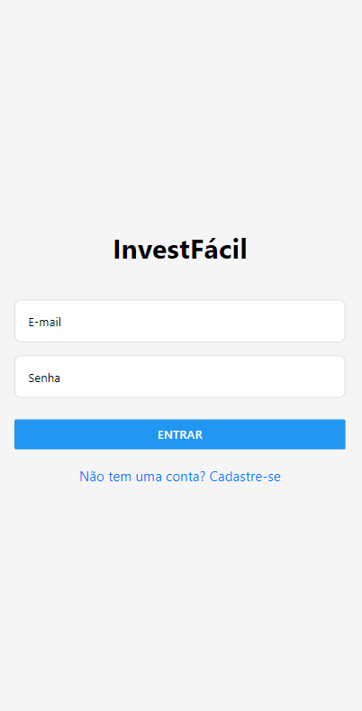
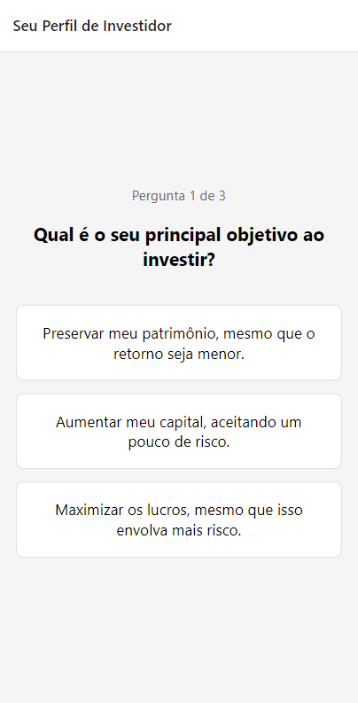
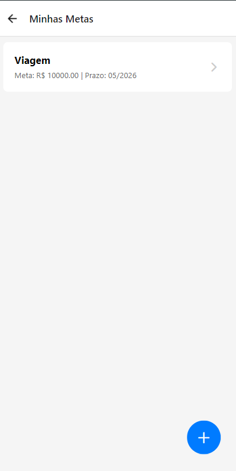
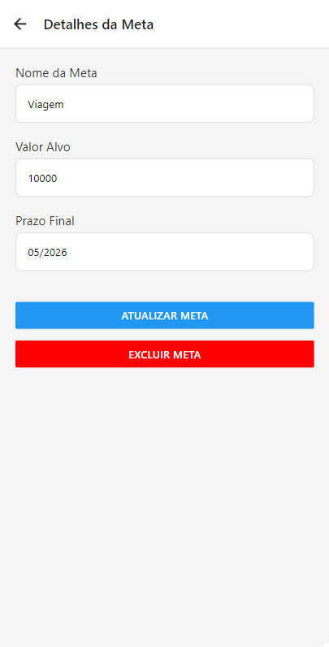

# InvestFácil 📈


InvestFácil é um aplicativo móvel, construído com React Native e Expo, que simula um assessor de investimentos virtual. O objetivo é identificar o perfil de investidor do usuário através de um quiz e, com base nisso, recomendar uma carteira de investimentos personalizada e ajudar no gerenciamento de metas financeiras.

## 🚀 Funcionalidades Principais

O aplicativo oferece um fluxo completo para o usuário, desde o cadastro até o acompanhamento de seus objetivos:

* **Autenticação de Usuários:** Sistema completo de Cadastro e Login utilizando **Firebase Authentication**.
* **Quiz de Perfil de Investidor:** Um questionário dinâmico para classificar o usuário como Conservador, Moderado ou Agressivo.
* **Recomendação de Carteira:** Com base no resultado do quiz, o app exibe uma carteira de investimentos personalizada com a alocação de ativos e explicações detalhadas.
* **Gerenciamento de Metas Financeiras:** Funcionalidade de CRUD (Criar, Ler, Atualizar e Deletar) completa para que o usuário possa cadastrar e gerenciar seus objetivos financeiros, com os dados salvos no **Cloud Firestore**.
* **Tratamento de Erros e Conexão:** Interface resiliente que informa o usuário sobre falhas de validação ou de conexão, com um mecanismo de "Tentar Novamente" em caso de interrupções de rede.

## 📱 Telas do Aplicativo

| Login / Cadastro | Quiz de Perfil | Carteira Recomendada |
|---|---|---|
|  |  |  |

| Lista de Metas | Detalhes da Meta |
|---|---|
|  |  |


## 🛠️ Tecnologias Utilizadas

* **React Native:** Framework para desenvolvimento de aplicativos móveis multiplataforma.
* **Expo:** Plataforma e conjunto de ferramentas para facilitar o desenvolvimento e build com React Native.
* **Firebase:** Utilizado para:
    * **Authentication:** Gerenciamento de sessões de usuário.
    * **Cloud Firestore:** Banco de dados NoSQL para salvar perfis e metas financeiras.
* **TypeScript:** Superset do JavaScript que adiciona tipagem estática ao código.
* **Expo Router:** Sistema de navegação baseado em arquivos para criar rotas no aplicativo.

## ⚙️ Como Executar o Projeto

Para executar este projeto localmente, siga os passos abaixo.

### Pré-requisitos

* [Node.js](https://nodejs.org/en/) (versão LTS recomendada)
* [npm](https://www.npmjs.com/) ou [yarn](https://yarnpkg.com/)
* [Expo Go](https://expo.dev/go) app no seu celular ou um emulador Android/iOS configurado.

### Passos de Instalação

1.  **Clone o repositório:**
    ```bash
    git clone [https://github.com/Gustavo-Dias23/InvestFacil.git](https://github.com/Gustavo-Dias23/InvestFacil.git)
    cd InvestFacil
    ```

2.  **Instale as dependências:**
    ```bash
    npm install
    ```

3.  **Configure o Firebase:**
    * Crie um projeto no [console do Firebase](https://firebase.google.com/).
    * Na seção **Authentication**, ative o provedor de login por **E-mail/senha**.
    * Na seção **Cloud Firestore**, crie um novo banco de dados (inicie no **modo de teste**).
    * Na raiz do projeto, crie um arquivo chamado `firebaseConfig.js`.
    * Copie e cole o seguinte código neste novo arquivo e preencha com as suas chaves do Firebase (você pode encontrá-las nas configurações do seu projeto no Firebase, ao registrar um novo app da Web):
        ```javascript
        // Importe as funções necessárias
        import { initializeApp } from "firebase/app";
        import { getAuth } from "firebase/auth";
        import { getFirestore } from "firebase/firestore";

        // Suas chaves de configuração do Firebase
        const firebaseConfig = {
          apiKey: "SUA_API_KEY",
          authDomain: "SEU_AUTH_DOMAIN",
          projectId: "SEU_PROJECT_ID",
          storageBucket: "SEU_STORAGE_BUCKET",
          messagingSenderId: "SEU_MESSAGING_SENDER_ID",
          appId: "SEU_APP_ID"
        };

        // Inicialize o Firebase
        const app = initializeApp(firebaseConfig);
        const auth = getAuth(app);
        const db = getFirestore(app);

        export { auth, db };
        ```

4.  **Execute o aplicativo:**
    ```bash
    npx expo start
    ```
    Escaneie o QR code com o aplicativo Expo Go ou execute em um emulador.

---

## Participantes do grupo
| Nome                 | RM      |
| -------------------- | ------- |
| Leonardo Moreira Valério | RM550988  |
| Breno Silva   | RM97864    |
| Enrico Marquez   | RM99325    |
| Joel Barros   | RM550378   |
| Gustavo Dias   | RM550820  |


Projeto desenvolvido como parte de projeto acadêmico da FIAP.
